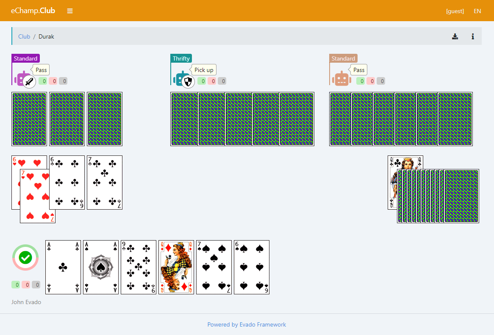

# E-Champ Durak

### The Durak is a browser card game.

This a module for [E-Champ](https://github.com/mkhorin/e-champ) platform.

The Durak game supports up to six players (bots and remote users) 
and implements various options:

- Attack the loser first
- Deck of 36 or 52 cards
- Lowest trump card beats trump ace
- Max attacks at once
- Max attacks before first discard
- Number of cards dealt at once
- Siege durak
- Stop attack on picking up
- Transferable durak
- Without trump

A detailed description and rules of the Durak can be found 
in [Wiki](https://en.wikipedia.org/wiki/Durak).

